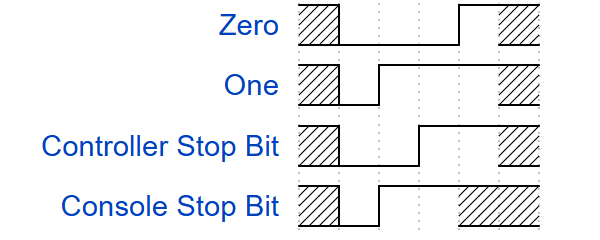
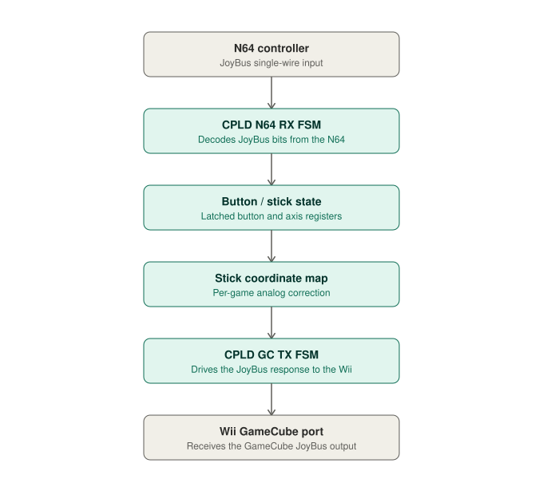

# Nintendo 64 to GameCube Adapter
A Verilog-based CPLD adapter to plug a Nintendo 64 controller into a GameCube/Wii — implemented entirely in combinational and sequential logic, with zero perceptible latency.


## Hardware

- Altera MAX V 5M570ZT100 CPLD (570 logic element budget)
- EarthPeopleTechnology UnoProLogic development board
- N64 controller extension cable (cut, wired to CPLD input)
- GameCube extension cable (cut, wired to CPLD output, plugs into Wii)
- Logic analyzer (for protocol capture / timing verification)

## Toolchain

- **Synthesis:** Quartus Prime
- **Simulation:** Icarus Verilog
- **Reference models / analysis:** Python (bit-exact stick-map model, logic analyzer CSV capture analysis)

## Prior Work

The following adapters are very well made projects with much more features and functionality. They are also going to be cheaper to purchase than building this project out. Both of these sites have a lot of documentation and other products that I would recommend checking out

- **[ElectroModder](https://electromodder.co.uk/)** makes an adapter with per-game analog stick correction for every N64 Wii VC title, rumble pak support, an OLED configuration menu, and active firmware updates.

- **[raphnet](https://www.raphnet-tech.com/)** sells also polished, N64-to-Wii/GameCube adapter which may be better for shipping depending on your location.


## Background

Both the Nintendo 64 and GameCube are wired controllers that use a single bi-directional open-drain data line.

Furthermore, they both use the same protocol to transmit data, known as JoyBus. This simplifies parts of the project and allows this RTL to fit into a 570 logic element footprint — a single receiver/decoder architecture on the N64 side is closely mirrored by the transmitter on the GameCube side.

### JoyBus Protocol

The JoyBus protocol operates by sending binary data encoded in how long the data line is pulled low. The exact timing depends on whether the controller or console is sending the command. Knowing this is useful when debugging, to see which device is transmitting on the data line. The exact timing is presented below:

| Bit | Source | Low Time (µs) | High Time (µs) | Total Period (µs) |
| :--- | :--- | :--- | :--- | :--- |
| 0 | console | 3.75 | 1.25 | 5 |
| 0 | controller | 3 | 1 | 4 |
| 1 | console | 1.25 | 3.75 | 5 |
| 1 | controller | 1 | 3 | 4 |

<small>via Jeff Longo's GameCube Controller Reverse Engineering</small>

The image below shows the JoyBus waveforms for the Nintendo 64. In this project, the N64 controller's own stop bit is not used — instead, the GameCube stop bit (which is identical to the One bit) is transmitted, since the adapter is speaking GameCube JoyBus outward.



<small>via n64brew.dev/wiki JoyBus Protocol</small>

## RTL Information

### Signal Flow



The CPLD's core clock is 22 MHz (`clk_core`), derived from the board's 66 MHz onboard oscillator via a divide-by-3 generator. All JoyBus timing constants (bit thresholds, idle detection, poll period) are defined relative to this clock. The clock was slowed down to handle setup time violation

<!-- Add info about csv sweeps and stick map -->


## Roadmap

- PCB layout is planned as the next phase. The current breadboard implementation has a ground anomaly, where the ground reference is routed through the logic analyzer, that needs to be resolved

## Building & Flashing

1. Open the project in Quartus Prime, run Analysis & Synthesis, then the Fitter.
2. Simulate any changed module against its testbench with Icarus Verilog before synthesizing:
   ```
   iverilog -o tb.vvp module.v module_tb.v && vvp tb.vvp
   ```
3. Generate the `.pof` programming file and flash

### A Note on Process

This project was developed with Claude as a collaborator for RTL debugging, architectural discussion, and documentation — while all hardware decisions, empirical validation, and hands-on debugging (multimeter probing, logic analyzer captures, hardware bring-up) were done independently. Where relevant, comments in the source distinguish confirmed hardware-validated behavior from suspected mechanisms and untested hypotheses.

## References
- Relevant documentation of stick map design, and design of ElectroModder's adapter: [ElectroModder Resources](https://electromodder.co.uk/about_wii_vc)
- Very useful source with a lot of information about JoyBus and details: [Jeff Longo — GameCube Controller Reverse Engineering](https://jefflongo.dev)
- Information about a variety of JoyBus devices and info: [n64brew.dev JoyBus Protocol wiki](https://n64brew.dev/wiki/Joybus_Protocol)
- [NicoHood's GameCube protocol documentation](https://github.com/NicoHood/Nintendo/wiki/Gamecube)